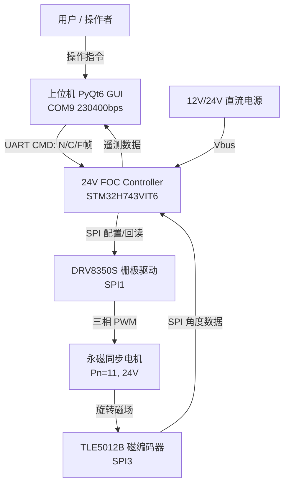
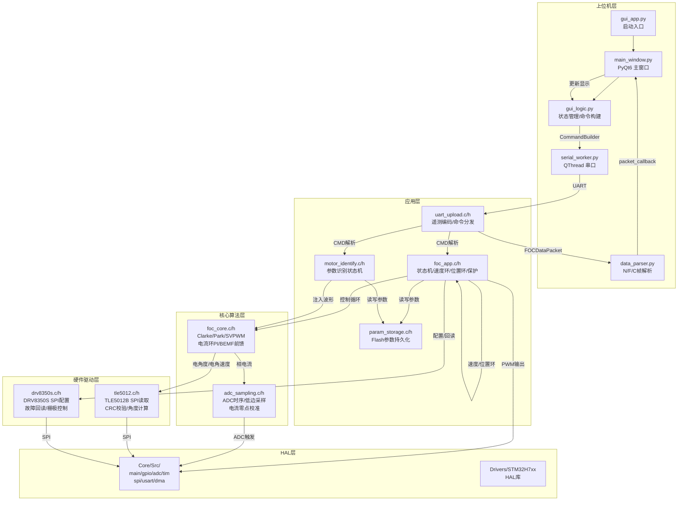

# 24V FOC Controller 架构

## 概述

基于 STM32H743 + TLE5012B + DRV8350S 的磁场定向控制（FOC）电机驱动器。支持力矩/速度/位置三环控制、自动参数识别（Rs/Ls/Ke/J/Pn/encoder_dir）、前馈补偿（BEMF/惯量/摩擦/齿槽），通过 UART 与上位机（PyQt6）通信。

## 系统上下文

## 高层组件图

## 子系统索引

| 子系统 | 文件 | 描述 |
|--------|------|------|
| FOC 核心 | `subsystems/foc-core.md` | Clarke/Park/SVPWM、电流环PI、BEMF前馈 |
| FOC 应用层 | `subsystems/foc-app.md` | 状态机、速度/位置环、故障保护 |
| 参数识别 | `subsystems/motor-identify.md` | Rs/Ls/Ke/J/Pn/encoder_dir 自动识别 |
| ADC 采样 | `subsystems/adc-sampling.md` | ADC时序控制、低边采样、电流校准 |
| UART 上传 | `subsystems/uart-upload.md` | N/C/F帧编码、FAULT_DETAIL、命令分发 |
| TLE5012 编码器 | `subsystems/tle5012.md` | SPI读取、CRC校验、角度/速度计算 |
| DRV8350S 驱动 | `subsystems/drv8350s.md` | SPI配置、故障回读、栅极控制 |
| 参数存储 | `subsystems/param-storage.md` | Flash读写、版本管理、CRC校验 |
| 上位机 | `subsystems/host-computer.md` | PyQt6 GUI、数据解析、实时波形 |
| STM32 HAL | `subsystems/stm32-hal.md` | 外设配置、ISR处理、DMA传输 |

## 技术栈

| 层 | 技术 | 用途 |
|----|------|------|
| MCU | STM32H743VIT6 (Cortex-M7, 480MHz) | FOC 实时控制 |
| 固件语言 | C11 (GCC ARM 10.3) | 控制算法、驱动 |
| 构建 | PowerShell build.ps1 + pyOCD CMSIS-DAP | 编译、烧录 |
| 编码器 | TLE5012B (SPI, 16bit) | 角度/速度反馈 |
| 栅极驱动 | DRV8350S (SPI) | 三相逆变器控制 |
| 上位机 | Python 3 + PyQt6 + pyqtgraph | GUI 监控与控制 |
| 串口 | UART 230400bps, DMA | 上下位机通信 |
| 参数存储 | STM32 Flash Bank2 Sector7 (0x081E0000) | 电机参数持久化 |

## 关键架构决策

### 2026-06-20: BEMF 量纲/符号修复 + 运行时诊断开关
- `motor_param.Ke` 语义固定为机械侧 Kt/Ke_mech (V·s/rad mechanical)
- BEMF 前馈使用 `Ke/Pn` 电角速度基准值
- `speed_elec` 不乘 `encoder_dir`（物理 BEMF 方向与坐标变换独立）
- BEMF 默认关闭，需显式使能
- 电流环电压分解诊断（CurrentLoopDiag/BEMF Ctrl）作为标准 FAULT_DETAIL 输出

### 2026-06-13: V5 Motion Speed Runtime Configuration
- 运动配置（speed/accel/cruise）改为运行时字段，支持 CMD:MOTION_CFG 即时修改
- 默认 speed=4.0 rad/s（24V）/ 1.5 rad/s（12V 安全上限）

### 2026-06-13: FOC Feedforward Baseline v1
- P1 BEMF + P2 Inertia + P3 Friction + P0 Cogging 全部就绪
- 位置模式 PREF ±20° 误差 ≤1.0°

### 2026-04-02: 初始架构捕获
通过 project-arch skill 初始创建。
