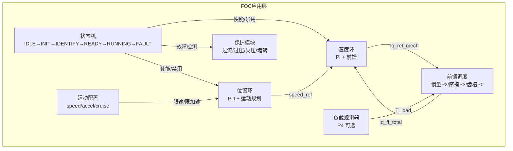
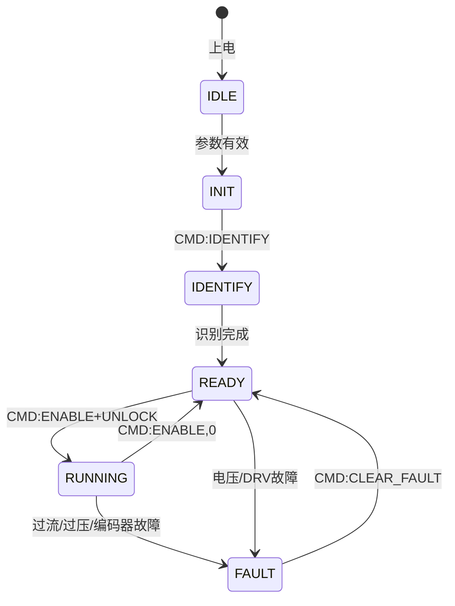

# FOC 应用层

## 职责

FOC 系统顶层状态机管理：启动/停止/故障处理、速度环/位置环控制、参数识别调度、前馈计算（惯量/摩擦/齿槽）、系统保护（过流/过压/欠压/堵转）。

## 内部结构



## 接口

### 提供的接口

| 接口 | 类型 | 描述 | 消费者 |
|------|------|------|--------|
| `FOC_App_Init()` | 函数 | 初始化应用层 | main.c |
| `FOC_App_MainLoop()` | 函数 | 主循环 (非ISR) | main.c |
| `FOC_App_RunControlCycle()` | 函数 | TIM1 ISR 控制周期 | ISR |
| `FOC_App_Enable/Disable()` | 函数 | 使能/禁用功率级 | UART命令 |
| `FOC_App_SetControlMode()` | 函数 | 力矩/速度/位置模式切换 | UART命令 |
| `FOC_App_SetSpeedRef/IqRef/PosRef()` | 函数 | 设置各模式参考值 | UART命令 |

### 依赖的接口

| 接口 | 类型 | 描述 | 提供者 |
|------|------|------|--------|
| 电流环 | 函数 | `FOC_Run()` 等 | FOC 核心 |
| 编码器角度/速度 | 函数 | `TLE5012_*` | TLE5012 |
| ADC 采样 | 函数 | `ADC_Sampling_*` | ADC 采样 |
| DRV8350S | 函数 | `DRV8350S_*` | DRV8350S |
| 参数存储 | 函数 | `Param_*` | 参数存储 |

## 关键数据结构

```c
typedef struct {
    FOC_Handle_t foc;              // FOC核心
    MotorParam_t motor_param;      // 电机参数
    MI_Handle_t mi_handle;         // 参数识别
    FOC_ProtectionConfig_t protection; // 保护阈值

    FOC_AppState_t state;          // 状态机状态
    FOC_ControlMode_t control_mode; // 力矩/速度/位置
    uint8_t power_unlocked;        // 功率级解锁标志
    uint8_t enable_pwm;            // PWM使能标志

    // 速度环
    FOC_PI_Controller_t pi_speed;  // 速度PI
    float speed_ref, speed_mech;   // 速度参考/反馈
    float speed_elec;              // 电角速度 (mech×Pn)

    // 位置环
    FOC_PositionPD_t pos_pd;       // 位置PD
    float pos_ref;                 // 位置参考 (控制坐标系)
    float position_speed_limit_radps;  // 位置模式速度上限

    // 前馈诊断
    FOC_FFDiag_t ff_diag;          // 前馈诊断数据

    // 电流环诊断
    // (见 foc_core.h 中的 diag_* 字段)
} FOC_AppHandle_t;
```

## 状态机



## 设计说明

1. **12V 安全速度上限**：`FOC_MOTION_CFG_SPEED_LIMIT_DEFAULT=1.5 rad/s`
2. **encoder_dir**：识别得到的编码器方向 (±1)，应用于 `theta_elec`、`speed_mech_user`、位置参考映射
3. **负向速度问题**：encoder_dir=-1 时负向 SREF 不转，速度环反馈符号链待排查
