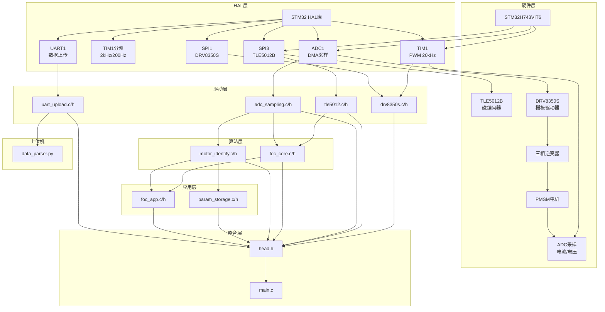
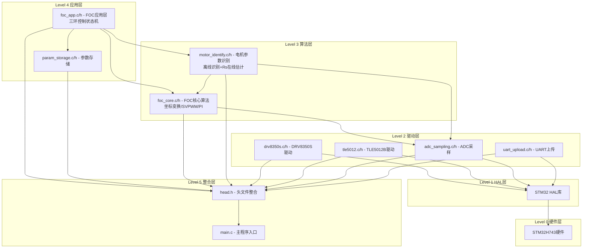
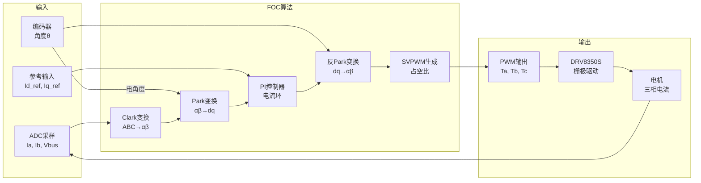
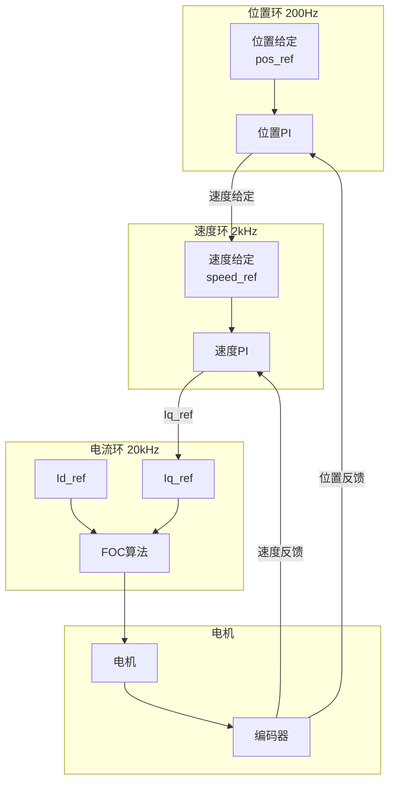
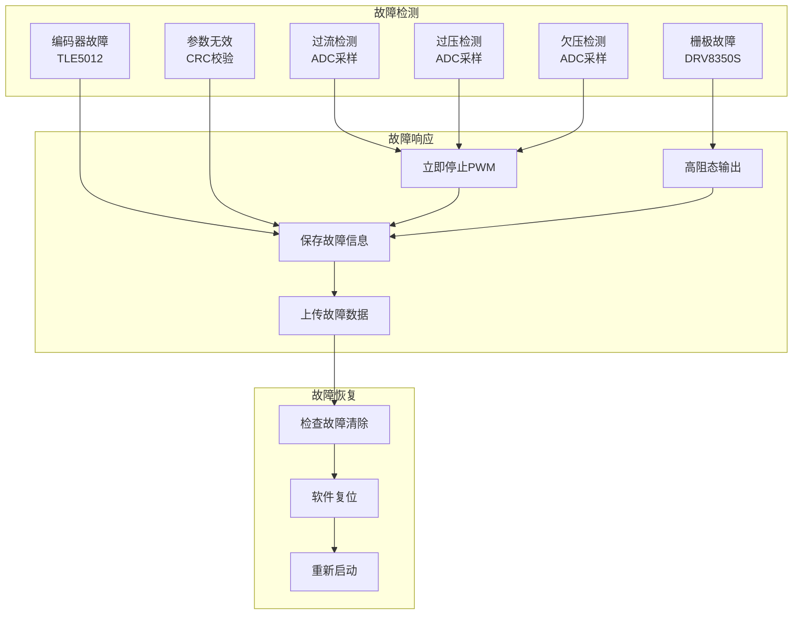

# 24V FOC Controller 项目架构文档

## 项目概述

### 系统简介
本项目是一个基于STM32H743VIT6微控制器的24V/10A关节电机FOC（磁场定向控制）控制系统，适用于机器人关节、伺服驱动等应用场景。

### 硬件平台
- **主控芯片**: STM32H743VIT6 (Cortex-M7, 480MHz)
- **磁编码器**: TLE5012B (SPI通信, 15位分辨率)
- **栅极驱动器**: DRV8350S (SPI配置, 6x PWM模式)
- **功率级**: 三相全桥逆变器
- **电源**: 24V DC输入
- **额定电流**: 10A (峰值20A)

### 主要功能
- FOC矢量控制（电流环20kHz，速度环2kHz，位置环200Hz）
- 电机参数自动识别（Pn、Rs、Ld/Lq、Ke、编码器零位）
- Rs在线温度补偿
- 参数Flash存储与CRC校验
- 故障保护与诊断
- UART数据上传与监控
- 三环控制：力矩/速度/位置模式

---

## 系统架构图



---

## 模块层次结构



---

## 数据流图

### FOC控制数据流



### 三环控制数据流



### 参数识别数据流

```mermaid
flowchart TB
    subgraph 离线识别
        START[开始识别] --> PN[极对数识别]
        PN --> RS[Rs识别<br/>直流伏安法]
        RS --> LS[Ls识别<br/>高频注入法]
        LS --> KE[Ke识别<br/>|Eαβ|/ωe(实测速度)]
        KE --> J[J/B识别<br/>当前为默认参数占位]
        J --> ALIGN[编码器对齐<br/>锁轴估计theta_offset]
        ALIGN --> SAVE[保存参数]
    end

    subgraph 在线补偿
        RUN[运行中] --> EST[Rs在线估计]
        EST --> UPDATE[更新PI参数]
        UPDATE --> RUN
    end

    subgraph 存储
        SAVE --> FLASH[Flash存储]
        FLASH --> CRC[CRC校验]
        CRC --> LOAD[参数加载]
    end
```

---

## 文件结构

```
24V FOC Controller/
├── Core/
│   ├── Inc/
│   │   ├── main.h              # 主程序头文件
│   │   ├── adc.h               # ADC初始化配置
│   │   ├── tim.h               # 定时器初始化配置
│   │   ├── spi.h               # SPI初始化配置
│   │   ├── usart.h             # UART初始化配置
│   │   ├── gpio.h              # GPIO初始化配置
│   │   ├── fdcan.h             # FDCAN初始化配置
│   │   ├── i2c.h               # I2C初始化配置
│   │   ├── dma.h               # DMA初始化配置
│   │   └── stm32h7xx_it.h      # 中断服务程序头文件
│   └── Src/
│       ├── main.c              # 主程序入口
│       ├── adc.c               # ADC初始化配置
│       ├── tim.c               # 定时器初始化配置
│       ├── spi.c               # SPI初始化配置
│       ├── usart.c             # UART初始化配置
│       ├── gpio.c              # GPIO初始化配置
│       ├── fdcan.c             # FDCAN初始化配置
│       ├── i2c.c               # I2C初始化配置
│       ├── dma.c               # DMA初始化配置
│       └── stm32h7xx_it.c      # 中断服务程序
│
├── MDK-ARM/
│   └── code/
│       ├── head.h              # 头文件整合
│       ├── foc_core.h/c        # FOC核心算法
│       ├── motor_identify.h/c  # 电机参数识别
│       ├── param_storage.h/c   # 参数Flash存储
│       ├── foc_app.h/c         # FOC应用层接口
│       ├── adc_sampling.h/c    # ADC采样处理
│       ├── tle5012.h/c         # TLE5012B编码器驱动
│       ├── drv8350s.h/c        # DRV8350S栅极驱动
│       └── uart_upload.h/c     # UART数据上传
│
├── HostComputer/
│   ├── data_parser.py          # 数据解析器
│   └── requirements.txt        # Python依赖
│
├── Drivers/
│   └── STM32H7xx_HAL_Driver/   # HAL库驱动
│
├── docs/                       # 文档目录
├── .vscode/                    # VS Code配置
├── .eide/                      # EIDE配置
├── Makefile                    # GNU Make编译文件
├── build.ps1                   # PowerShell编译脚本
└── README.md                   # 项目说明
```

---

## 模块接口定义

### 1. FOC核心模块 (foc_core.h)

```c
/* 数据结构 */
FOC_ABC_t           // 三相静止坐标系 (a, b, c)
FOC_AlphaBeta_t     // 两相静止坐标系 (alpha, beta)
FOC_DQ_t            // 两相旋转坐标系 (d, q)
FOC_PI_Controller_t // PI控制器结构体
FOC_SVPWM_t         // SVPWM输出结构体
FOC_Handle_t        // FOC控制句柄

/* 核心函数 */
void FOC_Clarke_Transform(const FOC_ABC_t *abc, FOC_AlphaBeta_t *alphabeta);
void FOC_Inverse_Clarke_Transform(const FOC_AlphaBeta_t *alphabeta, FOC_ABC_t *abc);
void FOC_Park_Transform(const FOC_AlphaBeta_t *alphabeta, float sin_theta, float cos_theta, FOC_DQ_t *dq);
void FOC_Inverse_Park_Transform(const FOC_DQ_t *dq, float sin_theta, float cos_theta, FOC_AlphaBeta_t *alphabeta);
void FOC_SVPWM_Generate(const FOC_AlphaBeta_t *ValphaBeta, float Vbus, FOC_SVPWM_t *svpwm);
void FOC_PI_Init(FOC_PI_Controller_t *pi, float Kp, float Ki, float output_max, float output_min);
float FOC_PI_Update(FOC_PI_Controller_t *pi, float error);
void FOC_Init(FOC_Handle_t *foc, float Kp_d, float Ki_d, float Kp_q, float Ki_q);
void FOC_SetCurrentReference(FOC_Handle_t *foc, float Id_ref, float Iq_ref);
void FOC_SetAngle(FOC_Handle_t *foc, float theta_elec);
void FOC_SetVbus(FOC_Handle_t *foc, float Vbus);
void FOC_UpdateCurrent(FOC_Handle_t *foc, float Ia, float Ib, float Ic);
void FOC_Run(FOC_Handle_t *foc);
void FOC_GetPWM(FOC_Handle_t *foc, uint16_t *pwm_a, uint16_t *pwm_b, uint16_t *pwm_c, uint16_t pwm_period);
void FOC_GetModulationWave(const FOC_Handle_t *foc, float *ma, float *mb, float *mc);

/* 辅助函数 */
static inline float FOC_Saturate(float value, float max, float min);
static inline float FOC_AngleNormalize(float angle);
```

实现注记（2026-03-04）：
- 电压链路常数统一为：`Vdq`矢量限幅 `Vbus/√3`，SVPWM相电压归一化基准 `Vbus/2`，避免指令电压与调制波缩放不一致导致的母线利用率损失。

### 2. 电机参数识别模块 (motor_identify.h)

```c
/* 数据结构 */
MotorParam_t        // 电机参数结构体 (Rs, Ld, Lq, Ke, Pn, J, B, theta_offset)
RsOnlineEstimator_t // Rs在线估计器
MI_Handle_t         // 识别控制句柄

/* 识别状态 */
MI_STATE_IDLE → MI_STATE_PN_IDENTIFY → MI_STATE_RS_IDENTIFY → 
MI_STATE_LS_IDENTIFY → MI_STATE_KE_IDENTIFY → MI_STATE_J_IDENTIFY → 
MI_STATE_ENCODER_ALIGN → MI_STATE_COMPLETE

/* 错误代码 */
MI_ERR_NONE, MI_ERR_MOTOR_MOVING, MI_ERR_RS_NOT_CONVERGED, 
MI_ERR_LS_NOT_CONVERGED, MI_ERR_KE_NOT_CONVERGED, MI_ERR_PN_NOT_CONVERGED,
MI_ERR_J_NOT_CONVERGED, MI_ERR_CURRENT_TOO_LOW, MI_ERR_CURRENT_TOO_HIGH, MI_ERR_TIMEOUT

/* 核心函数 */
void MI_Init(MI_Handle_t *handle, MotorParam_t *param, FOC_Handle_t *foc);
void MI_StartIdentify(MI_Handle_t *handle);
void MI_Process(MI_Handle_t *handle);  // TIM1 20kHz周期调用（识别态）
uint8_t MI_IsComplete(MI_Handle_t *handle);
MI_ErrorCode_t MI_GetError(MI_Handle_t *handle);
const char* MI_GetErrorString(MI_ErrorCode_t error);
MI_ErrorCode_t MI_IdentifyPn(MI_Handle_t *handle);
MI_ErrorCode_t MI_IdentifyRs(MI_Handle_t *handle);
MI_ErrorCode_t MI_IdentifyLs(MI_Handle_t *handle);
MI_ErrorCode_t MI_IdentifyKe(MI_Handle_t *handle);
MI_ErrorCode_t MI_IdentifyJ(MI_Handle_t *handle);
MI_ErrorCode_t MI_EncoderAlign(MI_Handle_t *handle);

/* Rs在线估计 */
void MI_RsOnlineEstimator_Init(RsOnlineEstimator_t *est, float alpha);
void MI_RsOnlineEstimator_Enable(RsOnlineEstimator_t *est, uint8_t enable);
void MI_RsOnlineEstimator_Update(RsOnlineEstimator_t *est, float Vd, float Vq, float Id, float Iq, float omega_e);
float MI_RsOnlineEstimator_GetRs(RsOnlineEstimator_t *est);
```

### 3. 参数存储模块 (param_storage.h)

```c
/* 数据结构 */
ParamHeader_t       // 参数头部 (magic, version, crc32, timestamp)
ParamPackage_t      // 完整参数包

/* 核心函数 */
ParamStatus_t Param_Load(MotorParam_t *param);
ParamStatus_t Param_Save(const MotorParam_t *param);
uint8_t Param_IsValid(const MotorParam_t *param);
uint32_t Param_CalculateCRC32(const void *data, uint32_t size);
```

### 4. FOC应用层模块 (foc_app.h)

```c
/* 数据结构 */
FOC_AppHandle_t     // FOC应用层句柄

/* 运行状态 */
FOC_STATE_IDLE → FOC_STATE_INIT → FOC_STATE_PARAM_IDENTIFY → 
FOC_STATE_READY → FOC_STATE_RUNNING / FOC_STATE_FAULT

/* 控制模式 */
FOC_MODE_TORQUE = 0     // 力矩模式：直接控制Iq
FOC_MODE_SPEED = 1      // 速度模式：速度环控制
FOC_MODE_POSITION = 2   // 位置模式：位置环+速度环

/* 故障代码 */
FOC_FAULT_NONE, FOC_FAULT_OVERCURRENT, FOC_FAULT_OVERVOLTAGE,
FOC_FAULT_UNDERVOLTAGE, FOC_FAULT_ENCODER, FOC_FAULT_DRV8350S, FOC_FAULT_PARAM_INVALID

/* 核心函数 */
void FOC_App_Init(FOC_AppHandle_t *handle);
void FOC_App_MainLoop(FOC_AppHandle_t *handle);
void FOC_App_TIM1_IRQHandler(FOC_AppHandle_t *handle);  // 20kHz
void FOC_App_SpeedLoop(FOC_AppHandle_t *handle);        // 2kHz (TIM1 10分频)
void FOC_App_PositionLoop(FOC_AppHandle_t *handle);     // 200Hz (TIM1 100分频)
void FOC_App_ParamIdentifyLoop(FOC_AppHandle_t *handle);// 兼容接口（识别已移至TIM1周期）

/* 控制接口 */
void FOC_App_Enable(FOC_AppHandle_t *handle);
void FOC_App_Disable(FOC_AppHandle_t *handle);
void FOC_App_SetCurrentRef(FOC_AppHandle_t *handle, float Id_ref, float Iq_ref);
void FOC_App_SetSpeedRef(FOC_AppHandle_t *handle, float speed_ref);
void FOC_App_SetPositionRef(FOC_AppHandle_t *handle, float pos_ref);
void FOC_App_SetControlMode(FOC_AppHandle_t *handle, FOC_ControlMode_t mode);

/* 参数管理 */
void FOC_App_LoadParam(FOC_AppHandle_t *handle);
void FOC_App_SaveParam(FOC_AppHandle_t *handle);
void FOC_App_StartIdentify(FOC_AppHandle_t *handle);
void FOC_App_StopIdentify(FOC_AppHandle_t *handle);
uint8_t FOC_App_IsIdentifyComplete(FOC_AppHandle_t *handle);

/* 状态查询 */
FOC_AppState_t FOC_App_GetState(FOC_AppHandle_t *handle);
FOC_FaultCode_t FOC_App_GetFault(FOC_AppHandle_t *handle);
const char* FOC_App_GetStateString(FOC_AppState_t state);
const char* FOC_App_GetFaultString(FOC_FaultCode_t fault);

/* 调试接口 */
void FOC_App_GetDebugInfo(FOC_AppHandle_t *handle, float *Id, float *Iq, float *Vd, float *Vq, 
                          float *theta, float *speed, float *Rs_est);
```

实现注记（2026-03-04）：
- TIM1故障路径采用“中断快速下电 + 主循环延后收尾”：中断内只做PWM关断与`DRV_EN`拉低，阻塞式DRV关断流程通过`pending_disable`在`FOC_App_MainLoop()`执行。

### 5. ADC采样模块 (adc_sampling.h)

```c
/* 数据结构 */
ADC_Sampling_t      // ADC采样数据结构

/* 采样通道 */
ADC_CH_CURRENT_A    // PA1 - 电流A相
ADC_CH_CURRENT_B    // PA2 - 电流B相
ADC_CH_CURRENT_C    // PA3 - 电流C相
ADC_CH_VBUS         // PC4 - 母线电压

/* 核心函数 */
int8_t ADC_Sampling_Init(ADC_HandleTypeDef* hadc);
void ADC_Sampling_Process(void);  // DMA中断调用
void ADC_Sampling_Calibrate(uint16_t samples);
float ADC_CalcCurrent(uint16_t raw, int16_t offset);
float ADC_CalcVoltage(uint16_t raw, float divider);
```

### 6. 编码器驱动模块 (tle5012.h)

```c
/* 数据结构 */
TLE5012_Data_t      // 编码器数据结构
    float angle;            // 角度值 0.0 ~ 360.0
    uint16_t raw_angle;     // 原始角度数据
    uint8_t status;         // 状态字节
    uint8_t crc_error;      // CRC错误标志
    uint8_t update_flag;    // 数据更新标志

/* 核心函数 */
void TLE5012_Init(void);
void TLE5012_StartRead(void);           // 触发异步DMA读取
void TLE5012_ProcessData(uint16_t *rx_buf);  // SPI DMA完成回调
float TLE5012_GetAngle(void);           // 获取角度值 (0-360度)

/* 外部变量 */
extern TLE5012_Data_t tle5012_sensor;
extern uint16_t tle5012_rx_buf[3];  // SPI接收缓冲区
```

### 7. 栅极驱动模块 (drv8350s.h)

```c
/* 数据结构 */
DRV8350S_Config_t   // 配置结构体
DRV8350S_Runtime_t  // 运行时数据
DRV8350S_Handle_t   // 驱动句柄

/* 核心函数 */
int8_t DRV8350S_Init(DRV8350S_Handle_t* handle, SPI_HandleTypeDef* hspi, 
                     TIM_HandleTypeDef* htim, GPIO_TypeDef* nscsPort, uint16_t nscsPin);
int8_t DRV8350S_Configure(DRV8350S_Handle_t* handle, const DRV8350S_Config_t* config);
void DRV8350S_SetDefaultConfig(DRV8350S_Config_t* config);
void DRV8350S_EnableGateDrivers(DRV8350S_Handle_t* handle);
void DRV8350S_DisableGateDrivers(DRV8350S_Handle_t* handle);
void DRV8350S_TIM1_UpdateCallback(DRV8350S_Handle_t* handle);  // 20kHz中断调用
void DRV8350S_DMA_CompleteCallback(DRV8350S_Handle_t* handle);
uint32_t DRV8350S_GetFaultFlags(DRV8350S_Handle_t* handle);
int8_t DRV8350S_ReadRegister(DRV8350S_Handle_t* handle, uint8_t regAddr, uint16_t* data);
```

实现注记（2026-03-04）：
- SPI1访问新增运行时互斥标志`syncBusy`，阻塞式寄存器访问与TIM1异步DMA轮询互斥，避免并发帧交叠导致寄存器读写错位。

### 8. UART上传模块 (uart_upload.h)

```c
/* 数据结构 */
DrvUart_DataPacket_t    // 数据包结构
    uint32_t timestamp;     // 时间戳 (ms)
    float    angle;         // 角度值 (0.0 ~ 360.0 度)
    uint16_t rawAngle;      // 原始角度数据
    uint8_t  crcError;      // CRC 错误标志
    uint16_t faultStatus1;  // FAULT_STATUS_1 寄存器
    uint16_t vgsStatus2;    // VGS_STATUS_2 寄存器
    uint32_t faultFlags;    // 解析后的故障标志
    uint8_t  isFaultActive; // 是否有故障
    float    Id, Iq;        // D/Q轴电流
    float    Vd, Vq;        // D/Q轴电压
    float    speed;         // 转速 (rad/s)
    float    Id_ref, Iq_ref;// D/Q轴电流参考
    uint8_t  focState;      // FOC状态
    uint8_t  packetType;    // 数据包类型

DrvUart_Statistics_t    // 统计信息

/* 数据包类型 */
DRV_PKT_TYPE_NORMAL     // 正常周期性数据
DRV_PKT_TYPE_FAULT      // 故障数据
DRV_PKT_TYPE_RESPONSE   // 响应数据
DRV_PKT_TYPE_DEBUG      // 调试数据

/* 核心函数 */
HAL_StatusTypeDef DrvUart_Init(UART_HandleTypeDef* huart, DRV8350S_Handle_t* drvHandle);
void DrvUart_DeInit(void);
void DrvUart_Process(void);  // main循环调用
void DrvUart_UploadImmediate(void);
bool DrvUart_UploadFault(void);
void DrvUart_SetEnable(bool enable);
void DrvUart_SetInterval(uint32_t intervalMs);
void DrvUart_GetStatistics(DrvUart_Statistics_t* stats);
void DrvUart_ClearFaultHistory(void);
uint8_t DrvUart_GetFaultHistoryCount(void);
void DrvUart_TxCpltCallback(UART_HandleTypeDef* huart);
bool DrvUart_HasActiveFault(void);
void DrvUart_GetLastFault(DrvUart_DataPacket_t* packet);
```

### 9. 上位机数据解析器 (data_parser.py)

```python
# 数据结构
@dataclass
class FOCDataPacket:
    timestamp: int = 0          # 时间戳
    angle: float = 0.0          # 角度 (度)
    raw_angle: int = 0          # 原始角度
    crc_error: bool = False     # CRC错误
    fault_status1: int = 0      # 故障状态1
    vgs_status2: int = 0        # VGS状态2
    fault_flags: int = 0        # 故障标志
    is_fault_active: bool = False
    Id: float = 0.0             # D轴电流
    Iq: float = 0.0             # Q轴电流
    Vd: float = 0.0             # D轴电压
    Vq: float = 0.0             # Q轴电压
    speed: float = 0.0          # 转速 (rad/s)
    Id_ref: float = 0.0         # D轴电流参考
    Iq_ref: float = 0.0         # Q轴电流参考
    foc_state: int = 0          # FOC状态

# 核心类
class FOCDataParser:
    def set_packet_callback(self, callback: Callable[[FOCDataPacket], None])
    def feed_data(self, data: bytes)  # 喂入原始串口数据

class CommandBuilder:
    @staticmethod
    def enable_motor(enable: bool) -> str
    @staticmethod
    def set_mode(mode: int) -> str        # 0=力矩 1=速度 2=位置
    @staticmethod
    def set_current_ref(id_ref: float, iq_ref: float) -> str
    @staticmethod
    def set_speed_ref(speed: float) -> str
    @staticmethod
    def set_position_ref(pos: float) -> str
    @staticmethod
    def start_identify() -> str
    @staticmethod
    def stop_identify() -> str
    @staticmethod
    def clear_fault() -> str
    @staticmethod
    def set_current_pi(kp: float, ki: float) -> str
    @staticmethod
    def set_speed_pi(kp: float, ki: float) -> str
    @staticmethod
    def set_position_pi(kp: float, ki: float) -> str
```

---

## 中断时序图

```mermaid
sequenceDiagram
    participant TIM1 as TIM1中断<br/>20kHz
    participant LOOP as TIM1分频任务<br/>2kHz/200Hz
    participant ADC as ADC DMA<br/>完成中断
    participant SPI1 as SPI1 DMA<br/>完成中断
    participant SPI3 as SPI3 DMA<br/>完成中断
    participant UART as UART DMA<br/>完成中断
    participant MAIN as Main循环

    Note over TIM1: 电流环控制周期 50μs
    loop 每50μs
        TIM1->>ADC: 触发ADC采样
        TIM1->>SPI1: 触发DRV8350S状态读取
        TIM1->>SPI3: 触发TLE5012角度读取
    end

    ADC-->>TIM1: DMA完成中断
    TIM1->>TIM1: 读取电流/电压数据
    TIM1->>TIM1: 执行FOC计算
    TIM1->>TIM1: 更新PWM占空比

    SPI1-->>TIM1: DMA完成中断
    TIM1->>TIM1: 解析DRV8350S状态
    TIM1->>TIM1: 故障检测

    SPI3-->>TIM1: DMA完成中断
    TIM1->>TIM1: 解析编码器角度
    TIM1->>TIM1: CRC校验

    Note over LOOP: TIM1分频任务（速度环2kHz，位置环200Hz）
    loop 每0.5ms / 每5ms
        LOOP->>LOOP: 计算电机转速（2kHz）
        LOOP->>LOOP: 速度环PI控制（2kHz）
        LOOP->>LOOP: 位置环PI控制（200Hz）
    end

    UART-->>MAIN: DMA发送完成
    MAIN->>MAIN: 清除发送忙标志

    Note over MAIN: 后台任务
    loop 每100ms
        MAIN->>MAIN: 调用DrvUart_Process()
        MAIN->>MAIN: 上传状态数据
        MAIN->>MAIN: 故障检测与处理
    end
```

---

## 控制周期说明

| 控制环 | 频率 | 周期 | 执行位置 | 主要功能 |
|--------|------|------|----------|----------|
| PWM更新 | 20kHz | 50μs | TIM1中断 | 电流采样、FOC计算、PWM更新 |
| 电流环 | 20kHz | 50μs | TIM1中断 | Id/Iq PI控制、SVPWM生成 |
| 速度环 | 2kHz | 0.5ms | TIM1中断(10分频) | 转速计算、速度PI控制 |
| 位置环 | 200Hz | 5ms | TIM1中断(100分频) | 位置PI控制、输出速度给定 |
| 参数识别 | 20kHz | 50μs | TIM1中断(每周期) | 识别状态机处理（与采样/PWM同步） |
| 状态上传 | 10Hz | 100ms | Main循环 | UART数据上传、故障监控 |
| Rs在线估计 | 1kHz | 1ms | TIM1中断(分频) | 低速时估计Rs并补偿 |

---

## 三环控制说明

### 力矩模式 (FOC_MODE_TORQUE)
- 直接设置 Iq_ref 控制输出力矩
- Id_ref 通常设为0（最大转矩电流比控制）
- 适用于需要直接控制力矩的应用

### 速度模式 (FOC_MODE_SPEED)
- 速度环PI控制器输出 Iq_ref
- 速度反馈来自编码器微分
- 适用于需要精确速度控制的应用

### 位置模式 (FOC_MODE_POSITION)
- 位置环PI控制器输出速度给定
- 速度环PI控制器输出 Iq_ref
- 位置反馈来自编码器角度
- 适用于伺服定位应用

---

## 故障保护机制



### 故障代码

| 代码 | 名称 | 说明 | 触发条件 |
|------|------|------|----------|
| 0 | FOC_FAULT_NONE | 无故障 | - |
| 1 | FOC_FAULT_OVERCURRENT | 过流 | 电流>15A |
| 2 | FOC_FAULT_OVERVOLTAGE | 过压 | 母线电压>28V |
| 3 | FOC_FAULT_UNDERVOLTAGE | 欠压 | 母线电压<18V |
| 4 | FOC_FAULT_ENCODER | 编码器故障 | CRC错误或通信失败 |
| 5 | FOC_FAULT_DRV8350S | 栅极驱动故障 | nFAULT引脚触发 |
| 6 | FOC_FAULT_PARAM_INVALID | 参数无效 | CRC校验失败 |

### 故障恢复策略（当前实现）

- `CMD:CLEAR_FAULT` 不再无条件恢复 `READY`。
- 固件会先尝试清除DRV故障，再复读故障寄存器并联合检查：
  - DRV故障位是否清零
  - 编码器数据是否有效
  - 母线电压是否在欠压/过压阈值范围内
- 仅当上述条件都满足时才从 `FAULT` 进入 `READY`，否则维持故障态并更新故障码。

---

## 内存使用估算

| 模块 | RAM使用 | Flash使用 | 说明 |
|------|---------|-----------|------|
| HAL库 | ~8KB | ~50KB | 标准HAL库 |
| FOC核心 | ~256B | ~4KB | 算法代码 |
| 参数识别 | ~512B | ~8KB | 识别算法 |
| 参数存储 | ~128B | ~1KB | Flash操作 |
| 应用层 | ~1KB | ~8KB | 状态机+三环控制 |
| ADC采样 | ~128B | ~2KB | 采样处理 |
| 编码器驱动 | ~64B | ~2KB | SPI通信 |
| 栅极驱动 | ~256B | ~6KB | SPI通信 |
| UART上传 | ~1KB | ~4KB | 数据上传 |
| **总计** | **~11KB** | **~85KB** | 估算值 |

---

## 开发工具链

- **IDE**: VS Code + EIDE / Keil MDK-ARM / STM32CubeIDE
- **HAL库**: STM32CubeH7
- **编译器**: ARM GCC / ARMCC
- **调试器**: ST-Link V3
- **串口工具**: SecureCRT / PuTTY / 自定义上位机
- **Python**: 3.8+ (上位机开发)

---

## 通信协议格式

### 下行命令 (PC → MCU)

```
CMD:ENABLE,1          # 使能电机
CMD:ENABLE,0          # 禁用电机
CMD:MODE,0            # 设置力矩模式
CMD:MODE,1            # 设置速度模式
CMD:MODE,2            # 设置位置模式
CMD:IREF,0.0,1.0      # 设置电流参考值 (Id_ref, Iq_ref)
CMD:SREF,10.0         # 设置速度参考值 (rad/s)
CMD:PREF,3.14159      # 设置位置参考值 (rad)
CMD:IDENTIFY,1        # 启动参数识别
CMD:IDENTIFY,0        # 中止参数识别
CMD:CLEAR_FAULT       # 清除故障
CMD:PI_CURRENT,0.1,0.01   # 设置电流环PI
CMD:PI_SPEED,0.5,0.1      # 设置速度环PI
CMD:PI_POS,1.0,0.01       # 设置位置环PI
```

注：命令需以换行符结束（`\n` 或 `\r\n`），固件按行解析。
上电默认关闭功率级，需下发 `CMD:ENABLE,1` 才会使能栅极驱动与PWM输出。

### 上行数据 (MCU → PC)

```
========== FOC Controller Status ==========
Time: 12345 ms

--- Encoder ---
Angle: 123.45 deg
Raw: 12345
CRC: OK

--- DRV8350S ---
FAULT: None
Fault Status 1: 0x0000
VGS Status 2: 0x0000

--- FOC Data ---
Id : 0.12 A
Iq : 1.50 A
Vd : 2.50 V
Vq : 12.00 V
Speed : 62.83 rad/s
Id_ref: 0.00 A
Iq_ref: 1.50 A
State : 4

======================================
```

---

## 近期架构修订（截至 2026-03-04）

截至 2026-03-04，近期代码主线修订如下：

1. 参数识别执行位置调整  
- 识别状态机在 TIM1 20kHz 周期执行，与ADC采样和PWM输出同周期同步。  
- Rs/Ls阶段在识别前刷新电流反馈，避免使用过时的 `IalphaBeta`。

2. 识别可中止机制  
- 新增 `FOC_App_StopIdentify()`；`CMD:IDENTIFY,0` 支持安全中止。  
- 采用临界区仅修改中止标志，避免主循环与中断并发重置识别结构体。

3. DRV故障处理稳健性  
- `DRV8350S_ClearFaults` 改为读改写 `DRIVER_CTRL`，避免破坏同寄存器其他配置位。  
- `DRV8350S_TriggerAsyncReadAll` 返回真实触发结果，便于上层监控异常。

4. 故障恢复条件收敛  
- `CMD:CLEAR_FAULT` 改为“条件恢复”，需同时满足驱动故障清除、编码器有效、母线电压正常。

5. PI控制器积分分离  
- 积分分离阈值从全局固定值改为每个PI实例独立阈值（按 `Kp` 与输出范围换算）。

6. Ke识别模型修正  
- 在测量窗口内采用静止坐标系反电势幅值估算：`|Eαβ| ≈ |Vαβ - Rs * Iαβ|`。  
- 再结合实测电角速度求 `Ke = |Eαβ| / |ωe|`，降低开环 `dq` 坐标失配带来的偏差。

7. 通信与启动细节  
- UART DMA接收重启失败增加失败计数与快速重试。  
- 启动默认 `DRV_EN` 低电平，消除“先高后低”瞬态窗口。

8. SPI1并发访问互斥  
- 新增 `syncBusy` 与 `DRV8350S_BusLock/BusUnlock`，阻塞式SPI访问（主循环）与TIM1异步DMA轮询实现互斥。  
- 异步轮询在同步访问占用期间自动让路，避免寄存器读写帧交叠与数据错位。

9. TIM1故障路径去阻塞  
- 新增ISR快速下电路径：故障时在中断内仅做PWM快速关断和 `DRV_EN` 拉低。  
- 阻塞式DRV收尾操作（含SPI访问）延后到主循环通过 `pending_disable` 执行，降低中断长阻塞风险。

10. FOC电压归一化与限幅一致化  
- `FOC_SetVbus/FOC_Init` 的电压矢量限幅统一为 `Vbus/√3`（SVPWM线性区）。  
- `FOC_SVPWM_Generate` 归一化基准改为 `Vbus/2`（调制波定义），并与抗积分饱和链路解耦对齐。

11. UART故障首报可靠性  
- `DrvUart_Process()` 仅在故障包成功进入DMA发送后更新 `s_lastFaultFlags`。  
- 避免“DMA忙/发送失败时先更新标志”造成首次故障边沿被吞掉。

12. 命令队列复制构建兼容性  
- `stm32h7xx_it.c` 中命令入队/出队由 `strncpy` 改为“有界长度函数 + memcpy”。  
- 消除 `-Werror` 下 `strncpy truncation` 告警导致的构建中断风险。

13. FOC调制波接口导出修正  
- `FOC_GetModulationWave()` 已在 `foc_core.h` 补齐声明，与 `foc_core.c` 实现保持一致。

14. 上位机单测入口兼容  
- `HostComputer/test_data_parser.py` 增加本地目录注入，支持在仓库根目录直接执行 `python -m unittest HostComputer/test_data_parser.py`。

15. DRV8350S 异步失败路径状态收敛  
- `DRV8350S_TriggerAsyncRead()` 在 DMA 启动失败分支补齐 `readReq.pending = 0`。  
- `DRV8350S_DMA_ErrorCallback()` 在 DMA 错误回调中同步清 `readReq.pending`。  
- 避免 `DRV8350S_BusLock()` 因等待 `pending==0` 长时间不满足而超时失败。

---

## 版本信息

- **版本**: v1.7
- **日期**: 2026-03-04
- **作者**: FOC开发团队
- **硬件**: STM32H743VIT6 + TLE5012B + DRV8350S

### 版本历史

| 版本 | 日期 | 变更说明 |
|------|------|----------|
| v1.0 | 2026-01-01 | 初始版本，基础FOC控制 |
| v1.1 | 2026-02-15 | 添加电机参数识别和Rs在线补偿 |
| v1.2 | 2026-02-22 | 添加位置环控制，更新文档 |
| v1.3 | 2026-03-02 | 控制链路与识别时序修订（TIM1统一调度） |
| v1.4 | 2026-03-03 | 故障恢复、Ke识别模型、识别中止并发与PI分离阈值修订 |
| v1.5 | 2026-03-04 | SPI1互斥访问、TIM1故障路径去阻塞、Ke估算改为αβ反电势幅值 |
| v1.6 | 2026-03-04 | FOC电压常数一致化、UART故障首报修复、命令复制告警修复、FOC接口导出补齐、单测入口兼容 |
| v1.7 | 2026-03-04 | DRV8350S异步读失败路径清理pending，避免BusLock等待超时 |
