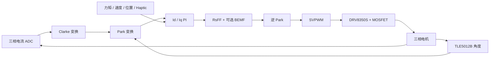
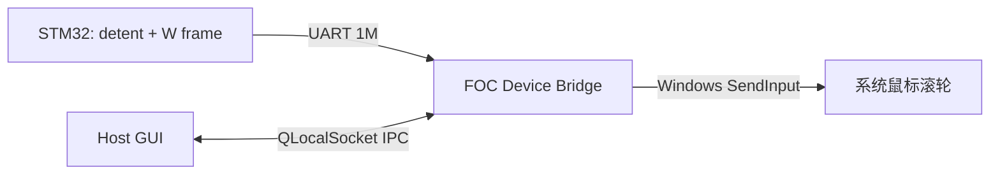

# STM32H743 FOC 关节电机控制器

一个面向关节电机、云台与力反馈交互的个人学习型 FOC 控制平台。

项目包含 STM32H743 固件、PySide6 上位机、高速电流遥测，以及把电机变成带力反馈鼠标滚轮的 Windows Bridge。当前经过台架验证的标准工作平台是 **12V**；仓库名称中的 `24V` 是历史命名，不代表当前推荐供电条件。

> 本项目仍处于个人研发和台架验证阶段，不是量产驱动器。首次运行新电机前，请先完成电流限幅、编码器方向和参数识别检查。

## 项目组成

| 组件 | 作用 |
| --- | --- |
| STM32 固件 | 三相 FOC、控制环、产品模式、参数识别、保护、遥测和诊断 |
| HostComputer | PySide6 调试上位机，负责控制、波形、参数识别和产品模式配置 |
| FOC Device Bridge | Windows 托盘程序，独占串口并把电机卡点转换为系统鼠标滚轮事件 |

## 主要功能

### 电机控制

- 电流、速度、位置三级控制架构。
- Clarke / Park 变换、双 `d-q` 电流 PI、逆 Park 与 SVPWM。
- 三相低边电流采样，ADC 由 `TIM1_CH4 / TRGO2` 在稳定窗口触发。
- TLE5012B 磁编码器，使用单线半双工 SPI 事务读取角度和 Safety Word。
- DRV8350S 栅极驱动器配置、状态读取和故障保护。
- 位置轨迹速度/加速度限制、速度给定斜坡和低速门控积分。
- DQ 域 Rs 电阻压降前馈、齿槽补偿，以及可选 BEMF 解耦诊断。
- 位置环直连电流环模式（`POS_DIRECT`）：低速稳态抖动比级联改善 69%，适合云台/关节电机低速定位（详见下方"低速平滑优化"）。
- 低速静摩擦连续补偿：指令方向锁存 + FF 库仑前馈（低速指令方向兜底）+ Stribeck 平滑，消除低速爬行与阶跃过冲。

### 产品模式

固件把底层 `TORQUE / SPEED / POSITION` 与面向使用场景的 `APP_MODE` 分开。上位机保存“用户选择模式”和“固件确认模式”，依赖顺序的命令通过 ACK 队列串行执行。

| APP_MODE | 底层控制域 | 功能 |
| --- | --- | --- |
| `RAW` | 用户选择 | 原始力矩、速度和位置控制 |
| `JOINT_POS` | POSITION | 关节位置控制、软限位和运动约束 |
| `GIMBAL_SPEED` | SPEED | 带加速度斜坡的云台速度控制 |
| `HOLD` | POSITION | 进入模式时捕获当前位置并保持 |
| `SPRING_DAMPER` | POSITION / haptic Iq | 虚拟弹簧与速度阻尼 |
| `DETENT` | POSITION / haptic Iq | 可配置卡点数量、强度、宽度、阻尼和电流限幅 |
| `SCROLL_WHEEL` | POSITION / haptic Iq | 独立滚轮参数、卡点事件量化和 Windows 鼠标滚轮注入 |

### 标定、保护与诊断

- 电机极对数、编码器方向、机械零点和电机参数识别流程。
- 上电默认锁定功率级，解锁和使能分离。
- 过流、母线电压、编码器、DRV8350S 和 ADC 采样故障保护。
- TLE5012 CRC / Safety 连续错误去抖，避免偶发噪声直接触发停机。
- 100 帧、50Hz 故障黑匣子；发生 fault 后自动冻结，可通过 UART 导出 CSV。
- `FAULT_DETAIL`、`PWM_DIAG`、`UART_RX_STAT`、ADC 噪声等诊断命令。
- 自动标定向导具备 precheck、busy 保护、STOP 中断和进度回报。

### 高速通信与遥测

- USART1 默认 `1,000,000 baud, 8N1`；`921600` 可作为备选。
- `1152000` 在当前 CH340C + STM32H743 硬件组合上双向不稳定，已明确禁用。
- RX 使用 256 字节 Circular DMA，通过 IDLE/位置增量消费数据，不在每条命令后重启 DMA。
- TX 使用 1024 字节中断环形队列：
  - `P0`：STOP、ACK、fault、滚轮事件。
  - `P1`：诊断和二进制流。
  - `P2`：周期遥测；反压时优先丢弃。
- ASCII 命令与状态帧用于控制、配置和诊断。
- 二进制电流流用于高速波形：
  - 帧格式：`A5 5A | 43 | 20 | payload(20B LE) | CRC-8`。
  - CRC-8 多项式：`0x07`。
  - `BIN 1000`：当前推荐档位，约 1000 fps。
  - `BIN 2000`：实验档，受 1Mbaud 和 TX ring 反压限制，无法稳定达到完整 2000 fps。

## 控制实现



当前定时基线：

| 项目 | 配置 |
| --- | --- |
| PWM | 20kHz，中心对齐，`ARR=11999` |
| 有效电流环 | 10kHz |
| 速度环 | 2kHz |
| 位置环 | 200Hz |
| 速度估算 LPF | 20Hz |

提高 `TIM1 ARR` 是当前电流环能够输出毫伏级电压指令的关键。旧的 `ARR=49` 会把小 PI 输出量化掉，使电流环在低电流参考下看起来“没有响应”。

## 12V 标准基线

以下参数来自当前 12V 台架电机，仅作为本项目默认值。更换电机、编码器、母线电压或功率级后必须重新标定。

```text
PI_CURRENT     = 0.50 / 0
PI_SPEED       = 0.25 / 0.001 gated
RS_FF_MODE     = DQ
RS_FF_SCALE    = 0.20
RS_FF_ADAPTIVE = OFF
BEMF           = OFF
COG            = 0.25 / +60 deg

MOTION_CFG     = speed 1.0 rad/s
                 accel 2.0 rad/s^2
                 cruise 0.3 rad/s

VBUS warning   = 10V / 18V
```

其中速度环积分只在有效速度参考和误差区间内累积；小参考回零时清空，输出饱和时执行 anti-windup，避免停车后的积分残留。

## 低速平滑优化（2026-08 台架实测，12V 云台/关节应用）

面向云台慢摇与关节电机低速应用的平滑性优化，实验主记录见 `docs/LOW_SPEED_SMOOTHNESS_EXPERIMENT.md`。

核心改动：

- **位置环直连电流环（POS_DIRECT）**：位置环 PD 输出直接作力矩指令，跳过速度环 PI（低速速度信号不可靠）。低速稳态位置纹波比级联改善 69%。
- **指令方向锁存连续静摩擦补偿**：以位置指令方向（非误差阈值）决定补偿方向，`encoder_dir` 坐标系修正；替代旧 bang-bang 误差死区（慢速斜坡下误差恒小导致补偿从不触发而爬行）。
- **FF 库仑低速前馈**：低速（<0.05 rad/s）库仑前馈用指令方向兜底（原死区使 2°/s 前馈从不触发），叠加 Stribeck 平滑（极低速给满静摩擦、随速度衰减到动摩擦）。
- **直连位置环条件积分**：仅 `|err|<2°` 时积分，消除静摩擦稳态误差而不加剧阶跃过冲。

```text
POS_DIRECT       = ON（运行时 CMD:POS_DIRECT,1）
POS_DIRECT_GAIN  = kp 0.5 / kd 0.03（默认；匀速跟踪测试用 kp 2.0，见实验文档权衡）
POS_DIRECT_KI    = 1.5
FRIC_COMP        = 0（pos_cmd_dir 独立补偿禁用，FF 库仑统一处理）
FF 库仑          = Tc/Kt + 指令方向低速兜底 + Stribeck（VS 0.01, KIN 0.2）
COG LUT          = 264 点标定（主导 22 次/圈磁阻力矩，`cogging_lut_cal.h`）
```

实测（2°/s 匀速扫 40°）：速度均值 0.82 → **1.73°/s（86% 目标）**，角度残差 18.6° → **3.9°**；0.5°/s 慢摇 **92% 跟踪**、残差 std 0.9°（当前架构实际可用下限）。

已知限制：**0.1°/s 极慢摇**受静摩擦非线性 + 低速速度估计噪声限制，位置补偿 / 速度模式 / 极低速固定补偿三种方案均未达标，需要速度观测器（规划中）。

## 上位机

`HostComputer` 是 PySide6 调试和产品模式界面，主要提供：

- 串口扫描、连接、功率级解锁/使能、STOP 和清故障。
- 力矩、速度、位置目标下发。
- 电机参数识别与状态回显。
- `JOINT_POS / GIMBAL_SPEED / HOLD / SPRING_DAMPER / DETENT / SCROLL_WHEEL` 面板。
- 电流、速度、位置和电压波形显示与 CSV 导出。
- 1kHz 电流数据接收与 20Hz 左右的 GUI 绘图刷新解耦，避免“每帧刷新一次”卡死界面。
- APP_MODE 选择状态和固件 ACK 确认状态分离，未同步时明确提示。
- 本地配置保存在 `%USERPROFILE%\.24v_foc_host_gui.json`。

源码运行：

```powershell
python -m pip install -r HostComputer/requirements.txt
python -m HostComputer.gui_app
```

打包 Windows 程序：

```powershell
powershell -NoProfile -ExecutionPolicy Bypass -File .\build_host_gui_app.ps1
```

输出：`dist/24V_FOC_Host/24V_FOC_Host.exe`

## 力反馈鼠标滚轮

`SCROLL_WHEEL` 由固件、Bridge 和 Host 三部分共同实现：



关键约束：

- Bridge 是滚轮会话和串口的唯一所有者，Host 在该场景下通过 IPC 观察和控制 Bridge。
- 固件只在有效 `WHEEL:SESSION` 内产生 W-frame。
- Bridge 只有在自身状态为 `WHEEL_ACTIVE` 且 W-frame 带有 session flag 时才注入系统输入。
- Bridge 每 250ms 发送 keepalive；固件 1 秒未收到保活会自动停止电机。
- 事件发送遇到 TX 反压时会合并剩余 delta，不在 ISR 中阻塞等待串口。

源码运行：

```powershell
python -m FOC_Device_Bridge.bridge_launcher
```

打包 Bridge：

```powershell
powershell -NoProfile -ExecutionPolicy Bypass -File .\FOC_Device_Bridge\build_bridge.ps1
```

输出：`dist/FOC_Device_Bridge.exe`

推荐启动顺序：

1. 启动 `FOC_Device_Bridge.exe`，Bridge 常驻系统托盘。
2. 启动 `24V_FOC_Host.exe`。
3. 在 Host 中选择控制板串口和 `1000000` 波特率并连接。
4. 进入“滚轮鼠标”页，点击“启用滚轮”。
5. 状态应从 `CONNECTED_IDLE` 进入 `WHEEL_ACTIVE`；转动电机后 Position 和 Total Delta 应递增。

## 编译固件

### 依赖

- Windows PowerShell 5.1 或 PowerShell 7。
- GNU Arm Embedded Toolchain。
- GNU Make 为可选项；默认 `build.ps1` 可直接完成 GCC 编译。
- 也可使用仓库中的 Keil MDK 工程。

### GCC 编译

```powershell
.\build.ps1
```

输出文件：

```text
build/gcc/24V_FOC_Controller.elf
build/gcc/24V_FOC_Controller.hex
build/gcc/24V_FOC_Controller.bin
build/gcc/24V_FOC_Controller.map
```

固件版本会在编译时注入当前 Git 短哈希，可通过 `SYS:FW_INFO?` 查询。

## 最小上手流程

1. 检查三相线、编码器、DRV8350S、电流采样和 12V 电源接线。
2. 编译并烧录固件。
3. 使用 HostComputer 以 `1000000 baud` 连接。
4. 查询 `SYS:FW_INFO?`，确认 `baseline=12V_STANDARD`。
5. 新电机先设置极对数并执行参数识别。
6. 从较小电流和较低速度开始验证方向。
7. 确认无 fault 后再进入位置、关节和 haptic 模式。

上电后功率级默认锁定。基础命令示例：

```text
SYS:FW_INFO?
CTRL:UNLOCK,1
CTRL:MODE,1
CTRL:ENABLE,1
CTRL:SREF,0.5
CTRL:STOP
```

所有文本命令必须以 `\n` 或 `\r\n` 结尾。完整命令见 [UART 命令参考](docs/UART_COMMANDS.md)。

## 测试

HostComputer：

```powershell
python -m unittest discover -s HostComputer -p "test*.py"
```

FOC Device Bridge：

```powershell
python -m unittest discover -s FOC_Device_Bridge -p "test*.py"
```

当前本地回归结果：

| 测试 | 结果 |
| --- | --- |
| HostComputer | 193 tests passed |
| FOC Device Bridge | 7 tests passed |
| UART `FW_INFO?` burst | 100/100，RX error 未增加 |
| BIN1000 + 并发命令 | 命令、STOP 和恢复路径通过 |
| RAW `SREF=+/-0.5` | 12V 台架双向跟踪通过 |
| 位置目标与 APP_MODE | 台架回归通过 |

## 项目结构

```text
.
|-- Core/                       STM32CubeMX/HAL 入口、中断和外设初始化
|-- Drivers/                    STM32 HAL 与 CMSIS
|-- MDK-ARM/code/
|   |-- foc_core.c/h            FOC 数学、PI、SVPWM、前馈
|   |-- foc_app.c/h             状态机、三环控制、APP_MODE、保护
|   |-- adc_sampling.c/h        ADC 采样与低边有效窗口
|   |-- tle5012.c/h             磁编码器驱动
|   |-- drv8350s.c/h            栅极驱动器
|   |-- motor_identify.c/h      参数识别
|   |-- uart_upload.c/h         UART TX 队列、遥测与诊断
|   |-- current_stream.c/h      高速二进制电流流
|   `-- wheel_input.c/h         滚轮卡点、会话和 W-frame
|-- HostComputer/               PySide6 上位机
|-- FOC_Device_Bridge/          Windows 滚轮 Bridge
|-- scripts/                    台架与回归脚本
|-- docs/UART_COMMANDS.md       UART 协议文档
|-- Project_Architecture.md     详细架构说明
|-- build.ps1                   固件 GCC 构建
`-- build_host_gui_app.ps1      HostComputer 打包
```

## 已知限制

- 当前唯一正式基线是 12V；没有维护 24V 参数集。
- `BIN 2000` 是实验档，1Mbaud 下受链路带宽和 TX ring 容量限制。
- `SCROLL_WHEEL` 目前只实现 Windows `SendInput` 路径。
- Spring、Detent 和 Scroll Wheel 的手感依赖电机、惯量、机械结构和参数，需要实机调节。
- CAN 多节点协议代码已预留，但 FDCAN 硬件初始化和多节点联调尚未完成，不应视为可用功能。
- 本项目未做功能安全认证、EMC 认证或量产可靠性验证。

## 安全说明

- 首次使能时不要让电机连接高风险负载。
- 使用限流电源，并确保可以快速断电。
- 参数识别和方向验证期间电机会转动。
- 更换电机或编码器后不要直接复用旧参数。
- 不要把软件 STOP 当作唯一急停手段。

## 文档

- [UART 命令参考](docs/UART_COMMANDS.md)
- [项目架构](Project_Architecture.md)
- [开发进度](PROGRESS.md)
- [开发过程记录](PROCESS.md)

## License

本项目原创代码和文档采用 [MIT License](LICENSE)。STM32 HAL、CMSIS、PySide6、Qt 及其他依赖仍遵循各自的许可证，详见 [THIRD_PARTY_NOTICES.md](THIRD_PARTY_NOTICES.md)。

`Ctrl-FOC-Lite` 仅作为设计参考，本仓库未复制或包含其源码。
